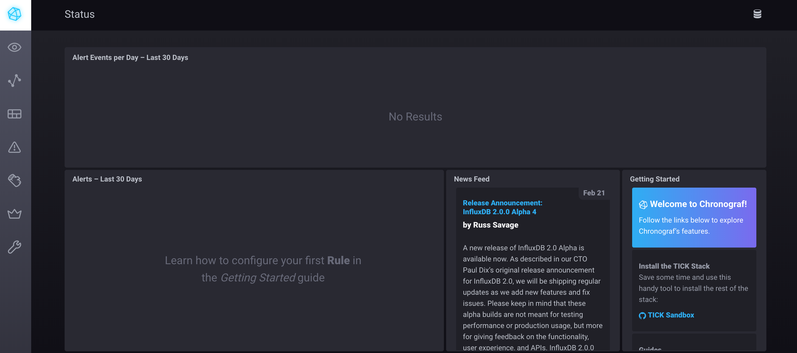

# TICK Stack Docker App Package

# Prerequisite
- [x] Docker: 18.09.1
- [x] Docker Compose: 1.24.0-rc1
- [x] Docker Swarm enabled (docker swarm init)
- [x] [Docker APP](https://github.com/docker/app)
  - [x] [Download Docker App from here for your Environment](https://github.com/docker/app/releases)

# Components
- [x] **T**elegraf
- [x] **I**nfluxdb
- [x] **C**hronograf
- [x] **K**apacitor

# Deploy
```
docker-app deploy
```

# Check the status of Docker Swarm Services
```
docker service ls
```

# Remove Docker Swarm TICK Stack
```
docker stack rm tick
```

# Access Chronograf
```
open http://localhost:8888
```



## Architecture


# Telegraf Configurations in this App Package:
- [x] [Consul](CONSUL.md)
- [x] [Elasticsearch](ELASTICSEARCH.md)
- [x] [RabbitMQ](RABBITMQ.md)
- [x] [ActiveMQ](ACTIVEMQ.md)
- [x] [Ping](PING.md)

*If you are a Grafana user then here are some useful Dashboards:*
# Grafana Dashboards:
- [x] [TIG metrics](https://grafana.com/dashboards/8709)
- [x] [Consul Cluster Health by Hashicorp](https://raw.githubusercontent.com/hashicorp/vault-consul-monitoring/master/dashboards/consul_cluster_health.json)
- [x] [Vault Cluster Health by Hashicorp](https://raw.githubusercontent.com/hashicorp/vault-consul-monitoring/master/dashboards/vault_cluster_health.json)

# **NOTES**
- [x] *Chronograf have labels setup if you are interested to run it behind Traefik*

# Resources
- [x] [TICK Stack with Docker Application Package](https://medium.com/@maxy_ermayank/tick-stack-with-docker-application-package-fd20384d2db0)
- [x] [Open Source Time Series Platform](https://www.influxdata.com/time-series-platform)
- [x] [Docker App Examples](https://github.com/docker/app/tree/master/examples)
